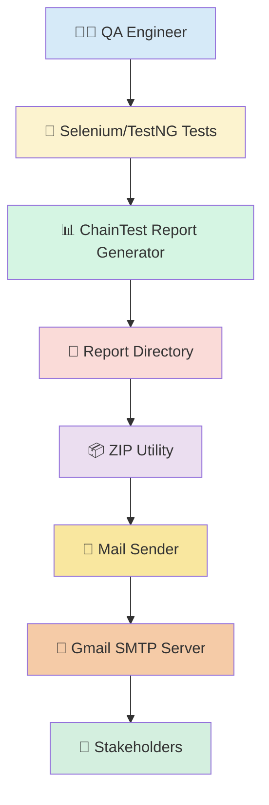
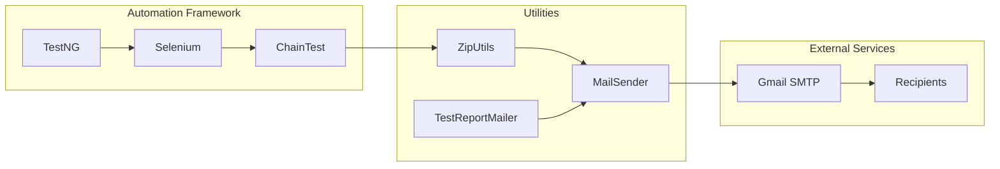
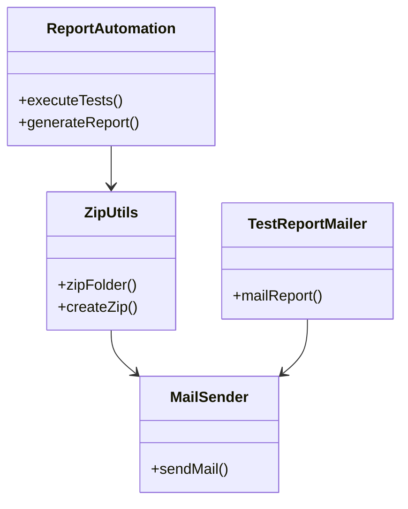
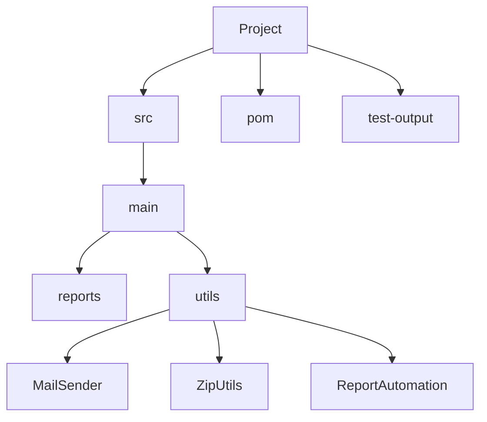
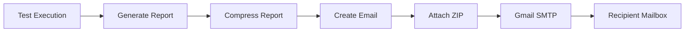

# 🚀 ChainTest Automation Report with Email & ZIP Delivery

<p align="center">


</p>

# 📖 Overview

An enterprise-ready Java automation utility that automatically generates ChainTest reports, compresses them into a ZIP archive, and emails the report to stakeholders after execution.

---

# 📑 Table of Contents

- 🎯 Features
- 🏗️ Architecture
- 🔄 Workflow
- 🛠️ Tech Stack
- 📁 Project Structure
- ⚙️ Installation
- 🔐 Configuration
- ▶️ Execution
- 📧 Email Automation
- 📦 ZIP Utility
- 🚀 CI/CD
- 🛡️ Security
- 🧩 Troubleshooting
- 🛣️ Roadmap
- 🤝 Contribution
- 📜 License

---

# 🎯 Features

- ✅ Automatic ChainTest Report Generation
- 📦 Automatic ZIP Compression
- 📧 Email Delivery with Attachment
- ☁️ Gmail SMTP Integration
- ⚡ Maven Build
- 🧪 TestNG Support
- 🏢 Enterprise Ready
- 🔄 CI/CD Friendly

---

# 🏗️ Architecture

mermaid
flowchart LR
A[Test Execution] --> B[ChainTest Report]
B --> C[ZIP Utility]
C --> D[JavaMail]
D --> E[Gmail SMTP]
E --> F[Stakeholders]

## 🏛️ Solution Architecture


---
## 🏗️ Component Architecture


## 🔄 Internal Class Diagram



## 📦 Package Structure


## 📧 Email Delivery Architecture



## 🚀 CI/CD Architecture

```mermaid

flowchart LR

Developer

-->

GitHub

-->

GitHub Actions

-->

Maven Build

-->

Selenium Tests

-->

ChainTest Report

-->

ZIP

-->

Email

-->

Stakeholders
```

## ☁️ Deployment Architecture

```mermaid

graph TD

Developer

-->

GitHub Repository

-->

CI/CD Server

-->

Automation Framework

-->

ChainTest Report

-->

ZIP Archive

-->

SMTP Server

-->

Recipients
```

## 🛡️ Security Flow

```mermaid

graph LR

Credentials

-->

SMTP Authentication

-->

TLS Encryption

-->

Gmail SMTP

-->

Recipient
```
# 🔄 End-to-End Workflow

mermaid
sequenceDiagram
participant QA
participant Framework
participant ZIP
participant Email

QA->>Framework: Execute Tests
Framework->>Framework: Generate Report
Framework->>ZIP: Compress Report
ZIP->>Email: Attach ZIP
Email->>QA: Send Report


---

# 🛠️ Technology Stack

| Technology | Purpose |
|------------|---------|
| Java 17 | Programming Language |
| Selenium 4 | Browser Automation |
| TestNG | Test Framework |
| Maven | Dependency Management |
| ChainTest | Reporting |
| JavaMail | Email |
| ZIP Utilities | Compression |

---

# 📁 Project Structure

text
ChainTestwithEmailZip
│
├── src
│   ├── main
│   ├── utils
│   │   ├── MailSender.java
│   │   ├── ZipUtils.java
│   │   └── ReportAutomation.java
│   └── resources
├── test-output
├── pom.xml
└── README.md


---

# ⚙️ Installation

## Clone Repository

bash
git clone https://github.com/Vinothkumar-SV/ChainTestwithEmailZip.git
cd ChainTestwithEmailZip

## Build

bash
mvn clean install


## Execute

bash
mvn test


---

# 🔐 Gmail Configuration

Enable:

- ✅ Two-Step Verification
- ✅ App Password

Configure SMTP:

properties
mail.smtp.host=smtp.gmail.com
mail.smtp.port=587
mail.smtp.auth=true
mail.smtp.starttls.enable=true


Update your sender details inside `MailSender.java`.

---

# 📧 Email Automation Flow

mermaid
graph TD
A[Generate Report] --> B[Create ZIP]
B --> C[Compose Email]
C --> D[Attach ZIP]
D --> E[Send Email]
E --> F[Recipient Inbox]

---

# 📦 ZIP Generation

The framework automatically:

- Compresses report folders
- Preserves folder hierarchy
- Creates lightweight ZIP archives
- Attaches ZIP to email

---

# 🚀 CI/CD Integration

Supported Platforms:

- 🟢 Jenkins
- 🟣 GitHub Actions
- 🔵 Azure DevOps
- 🟠 GitLab CI

Example GitHub Actions:

yaml
name: Java Automation

on: [push]

jobs:
  build:
    runs-on: ubuntu-latest

    steps:
      - uses: actions/checkout@v4

      - uses: actions/setup-java@v4
        with:
          java-version: '17'
          distribution: 'temurin'

      - run: mvn clean test

---

# 🛡️ Security Best Practices

- 🔒 Never hardcode passwords
- 🔑 Use Gmail App Passwords
- 🌱 Store secrets in environment variables
- 🚫 Exclude `.env` and credentials from Git
- 🔄 Rotate credentials periodically

---

# 🧩 Troubleshooting

| Problem | Solution |
|---------|----------|
| Authentication Failed | Verify Gmail App Password |
| Email Not Sent | Check SMTP Host and Port |
| ZIP Missing | Verify report path |
| Report Missing | Confirm ChainTest execution |

---

# 🛣️ Future Roadmap

- ☁️ Outlook OAuth Support
- 📊 Allure Report Integration
- 📈 Extent Report Support
- 💬 Microsoft Teams Notifications
- 📱 Slack Notifications
- 📄 HTML Email Templates
- 🔁 Retry Mechanism
- 🔐 Azure Key Vault Integration

---

# 🤝 Contribution

1. Fork the repository
2. Create a feature branch
3. Commit changes
4. Push to GitHub
5. Create a Pull Request

---

# 📜 License

This project is licensed under the **MIT License**.

---

# 👨‍💻 Author

**Vinoth Kumar S**

Senior Automation Engineer | QA Mentor | AI Solutions Enthusiast

GitHub: https://github.com/Vinothkumar-SV

---

# ⭐ Support

If this project helped you, please consider giving it a **⭐ Star** on GitHub.

Happy Testing! 🚀
